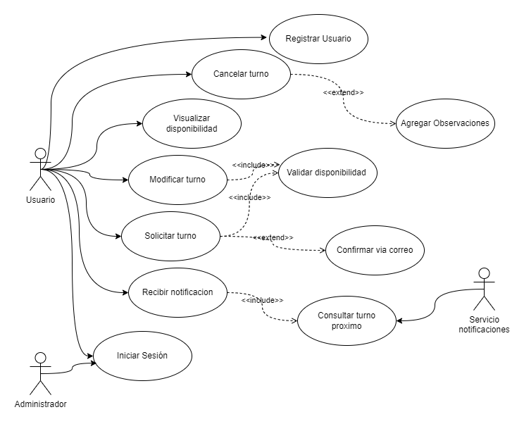
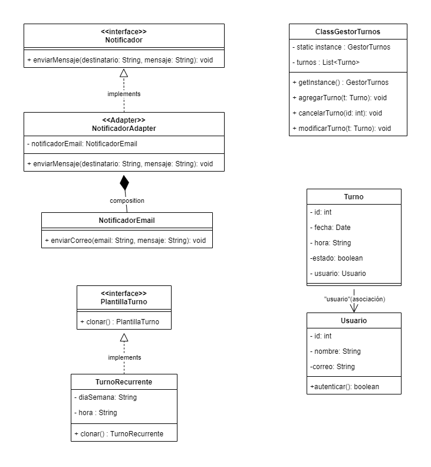
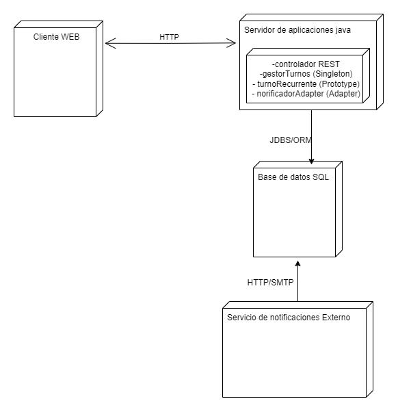

# Tunomático — Sistema de Gestión de Turnos Digitales

## Descripción General

**Tunomático** es un sistema digital profesional de gestión de turnos, orientado a mejorar la atención de usuarios y la eficiencia administrativa. Diseñado bajo principios de programación orientada a objetos en Java, incorpora patrones de diseño reconocidos para garantizar escalabilidad, mantenibilidad y claridad arquitectónica.

El sistema permite a los usuarios solicitar, modificar y cancelar turnos en línea, mientras que el personal administrativo puede gestionar plantillas recurrentes, disponibilidad y recibir alertas automáticas. Tunomático incluye integración con servicios externos de notificación a través de un adaptador, y se basa en una arquitectura distribuida entre cliente, servidor de aplicación y base de datos.

---

## Diagrama de Casos de Uso

### Descripción y Justificación de Relaciones

- **Actores:** Usuario, Administrador y Servicio de Notificaciones Externo.
- **Casos principales:** Solicitar turno, Cancelar turno, Modificar turno, Visualizar disponibilidad, Registrar usuario, Iniciar sesión.
- **Relaciones clave:**
  - `Solicitar turno` <<include>> `Validar disponibilidad`: garantiza que la lógica de disponibilidad siempre se aplique.
  - `Solicitar turno` <<extend>> `Confirmar vía correo`: agrega un paso opcional de validación por email.
  - `Cancelar turno` <<extend>> `Agregar observaciones`: permite que el usuario agregue un motivo al cancelar.
  - `Modificar turno` <<include>> `Validar disponibilidad`: verifica que el nuevo turno esté libre.
  - `Recibir notificación` <<include>> `Consultar turno próximo`: automatiza recordatorios.

---

## Diagrama de Clases UML

### Justificación de Patrones de Diseño Aplicados

- **Singleton – `GestorTurnos`:**
  - Se implementa como una clase única para centralizar la lógica de gestión de turnos.
  - Previene conflictos al garantizar una única instancia accediendo a la lista de turnos.

- **Prototype – `TurnoRecurrente`:**
  - Facilita la clonación de plantillas de turnos semanales o recurrentes sin necesidad de recrearlas manualmente.
  - Mejora la reutilización y reduce el acoplamiento.

- **Adapter – `NotificadorAdapter`:**
  - Adapta un sistema de envío de correos externo (`NotificadorEmail`) a la interfaz estándar del sistema (`Notificador`).
  - Permite cambiar la tecnología de notificaciones sin modificar el resto del sistema.

Todas las clases mantienen visibilidad adecuada, atributos definidos, métodos esenciales y relaciones bien estructuradas. No existen clases huérfanas ni acoplamientos innecesarios.

---

## Diagrama de Implementación UML

### Decisiones Técnicas y Arquitectura Física

- **Cliente Web:** Interfaz web que permite al usuario acceder al sistema desde un navegador.
- **Servidor de Aplicaciones Java:**
  - Implementado en Java con controladores REST.
  - Contiene la lógica de negocio, el gestor de turnos (Singleton), clonado de plantillas (Prototype) y envío de notificaciones (Adapter).
- **Base de Datos:** Motor SQL para almacenar usuarios, turnos, historial y logs.
- **Servicio Externo:** Integración mediante HTTP/SMTP con sistemas externos de correo.

La arquitectura garantiza separación de responsabilidades, escalabilidad y posibilidad de integrarse con microservicios en el futuro.

---

## Reflexiones Finales del Modelado

Tunomático representa una aplicación sólida de diseño orientado a objetos aplicado a un problema real. La transición desde los casos de uso hasta la arquitectura física demuestra una alineación clara entre necesidades funcionales y decisiones técnicas. 

El uso de patrones de diseño no solo mejora la calidad del código, sino que también prepara al sistema para futuras extensiones como autenticación avanzada, analítica de uso o integración con aplicaciones móviles. El modelado UML permitió visualizar de forma estructurada cada aspecto del sistema, contribuyendo a un desarrollo más controlado y profesional.

---
 
**Carrera:** Ingeniería en Informática 
